## Objetivo

O objetivo deste projeto é analisar a inadimplência dos consumidores das distribuidoras de energia elétrica ao longo dos anos, suas correlações com indicadores econômicos, variações por classe de consumo, e identificar padrões sazonais. Esta análise ajudará a entender os fatores que contribuem para a inadimplência e a desenvolver estratégias para mitigar seus impactos.

## Problema a Ser Analisado

A inadimplência nas contas de energia elétrica é um problema significativo para as distribuidoras, pois afeta diretamente o fluxo de caixa e a capacidade de investimento em infraestrutura e melhoria dos serviços. A inadimplência pode ser influenciada por diversos fatores, incluindo:

1. **Condições Econômicas**:

   - **Desemprego**: Altas taxas de desemprego podem reduzir a capacidade de pagamento dos consumidores.
   - **Inflação**: O aumento dos preços pode levar os consumidores a priorizarem outras despesas essenciais.
   - **PIB**: Um baixo crescimento econômico pode indicar menor atividade econômica e maior dificuldade financeira para os consumidores.

2. **Fatores Sazonais**:

   - **Estação do Ano**: O consumo de energia pode variar conforme a estação, afetando a capacidade de pagamento.
   - **Eventos Específicos**: Pandemias, crises econômicas ou desastres naturais podem impactar a inadimplência.

3. **Classe de Consumo**:

   - **Residencial**: Geralmente impactada por condições econômicas e sazonalidade.
   - **Comercial**: Influenciada por desempenho econômico e demanda de mercado.
   - **Industrial**: Dependente da atividade industrial e consumo de energia.

4. **Políticas Tarifárias e de Suspensão de Serviço**:
   - **Tarifas**: Mudanças nas tarifas de energia podem influenciar a capacidade de pagamento.
   - **Políticas de Suspensão**: Regras sobre suspensão de serviço por inadimplência podem afetar o comportamento dos consumidores.

## Perguntas a Serem Respondidas

1. **Qual a variação da inadimplência por classe de consumo nos anos de 2021 e 2022?**

   - Analisaremos os dados de inadimplência segregados por diferentes classes de consumo, comparando os anos de 2021 e 2022 para identificar variações e tendências.

2. **Qual é a correlação entre inadimplência e indicadores econômicos?**

   - Avaliaremos a relação entre os índices de inadimplência e diversos indicadores econômicos, como PIB, IPCA, e taxa de desemprego.

3. **Qual é a tendência geral da inadimplência ao longo dos anos?**

   - Identificaremos a tendência geral da inadimplência ao longo de um período estendido, para detectar padrões de aumento ou diminuição.

4. **A inadimplência apresenta sazonalidades?**

   - Realizaremos uma análise sazonal para verificar se há variações significativas na inadimplência em diferentes épocas do ano.

5. **Qual a performance das distribuidoras em relação à inadimplência (Top 10 Distribuidoras)?**

   - Avaliaremos o desempenho das distribuidoras, destacando as 10 melhores em termos de controle da inadimplência.

6. **Como a inadimplência se comportou durante a pandemia (2021-2022)?**
   - Analisaremos como a pandemia impactou os índices de inadimplência nos anos de 2021 e 2022.

## Descrição

Este repositório contém o projeto MVP do curso de Engenharia de Dados, focado na análise de inadimplência dos consumidores das distribuidoras de energia elétrica utilizando as plataformas Azure e Databricks. O objetivo principal é entender as variações de inadimplência ao longo dos anos, suas correlações com indicadores econômicos, variações por classe de consumo, e identificar padrões sazonais.

## Estrutura do Projeto

### Camada Bronze

Armazenamento dos dados brutos extraídos de diversas fontes, mantendo-os em seu formato original.

### Camada Silver

Nesta camada, os dados da camada Bronze são limpos e transformados, aplicando regras de qualidade e padronização.

### Camada Gold

Dados refinados e integrados para análises e visualizações. Tabelas de fato e dimensões são criadas usando o esquema estrela.

## Fontes de Dados

- [Inadimplência nas Distribuidoras - Dados Abertos GOV.BR](https://dados.gov.br/dados/conjuntos-dados/indqual-inadimplencia)

- [Produto Interno Bruto (PIB) - Dados Abertos GOV.BR](https://api.bcb.gov.br/dados/serie/bcdata.sgs.1207/dados?formato=csv&dataInicial=01/01/2012&dataFinal=31/05/2024)

- [Inflação (IPCA) e Taxa Desemprego - IPEA Dados Abertos GOV.BR](https://www.ipea.gov.br/cartadeconjuntura/index.php/series-estatisticas-conjunturais-2/)

## [Catálogo de Dados do Projeto](catalogo_dados.md)

## Cluster configurado

### 

## Diagramas

### Arquitetura da Solução

### 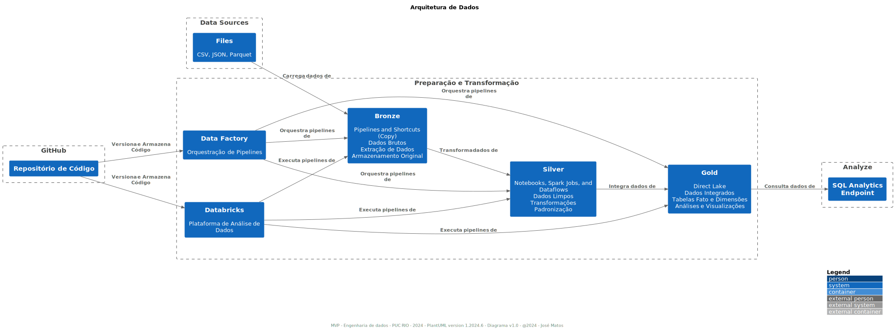

### Esquema Estrela

### 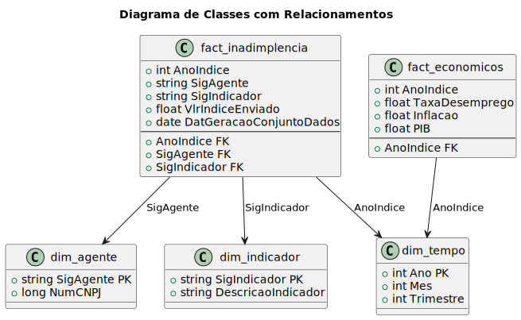

## Pipeline

### 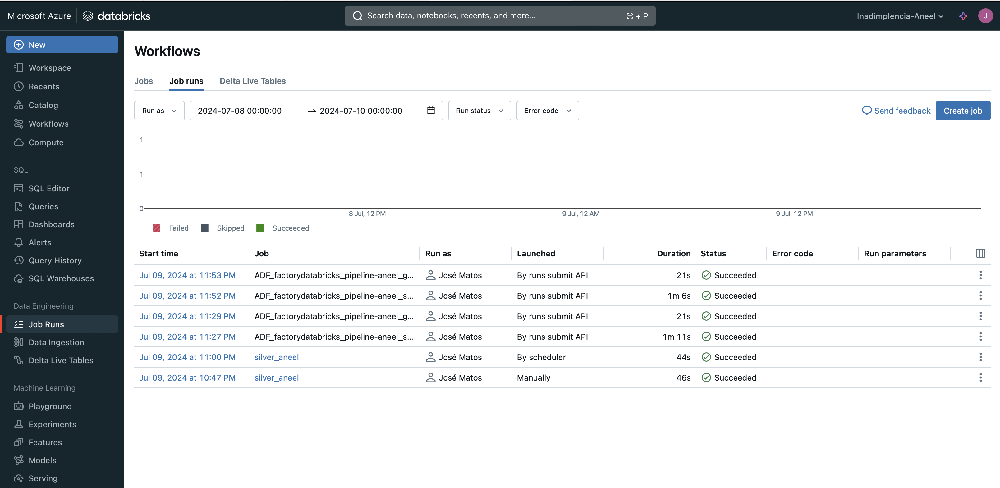

### 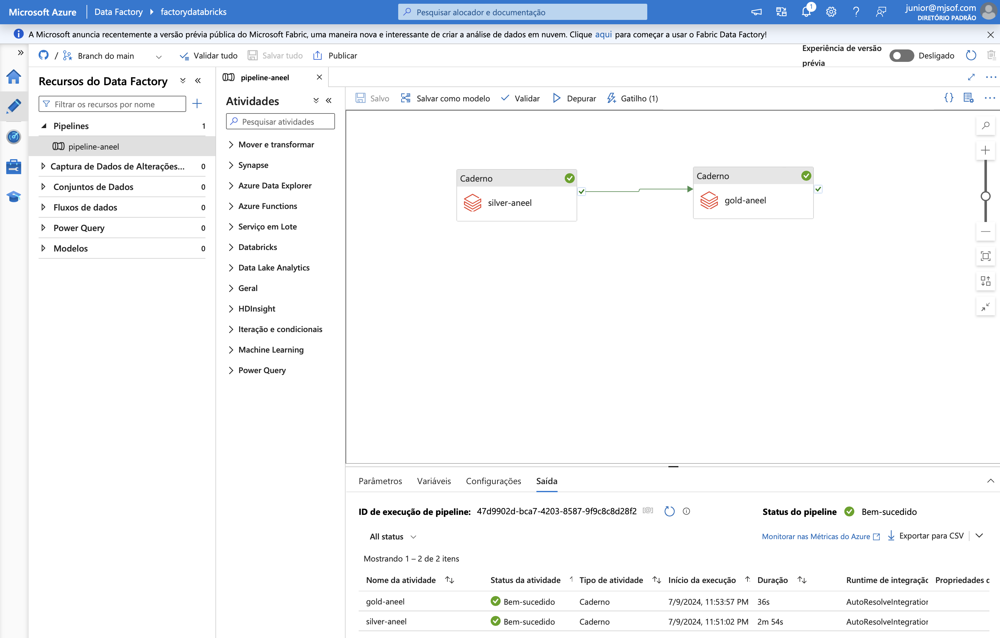

## Camadas (Bronze, Silver, Gold)

### 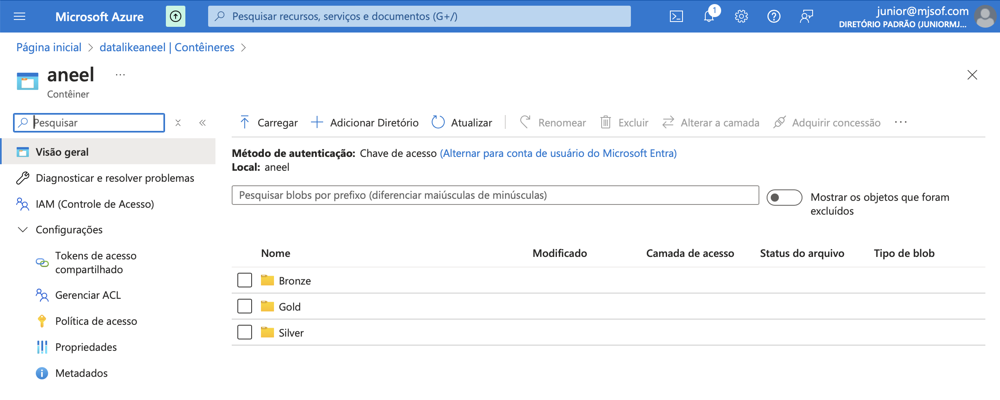

## Bronze

### 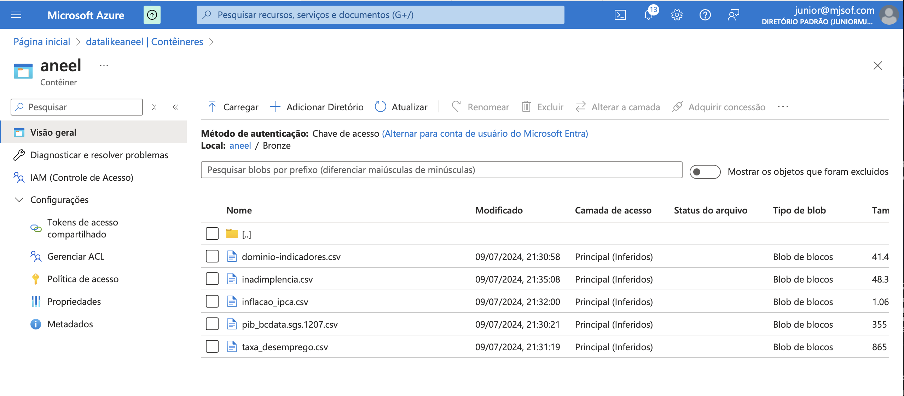

## Silver

### 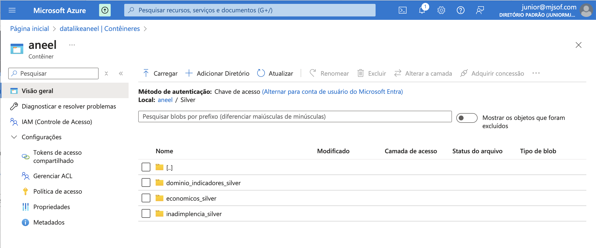

### 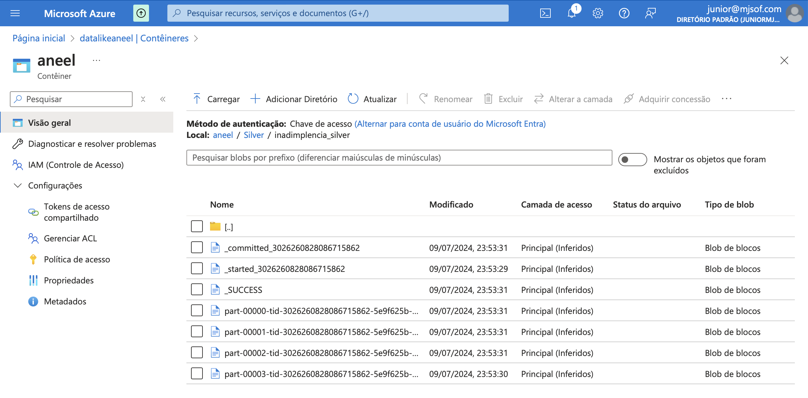

## Gold

### 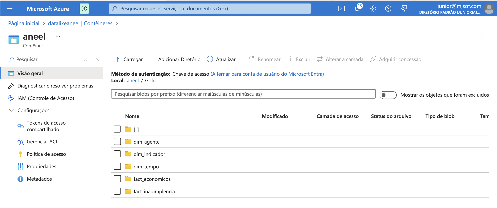

### 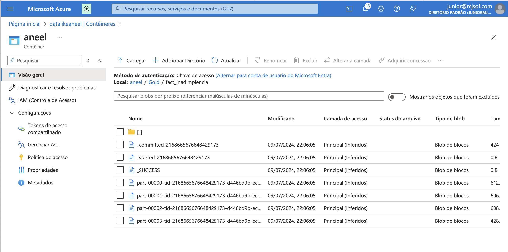

## Analises

## Pergunta 1: Como a inadimplência varia por classe de consumo nos anos de 2021 e 2022?

A análise mostra que a inadimplência varia significativamente entre as diferentes classes de consumo. A classe residencial apresenta os maiores valores de inadimplência, com um aumento contínuo de 2021 para 2022. As classes comercial, industrial, rural e de serviço público apresentam valores de inadimplência muito menores em comparação à classe residencial.

### 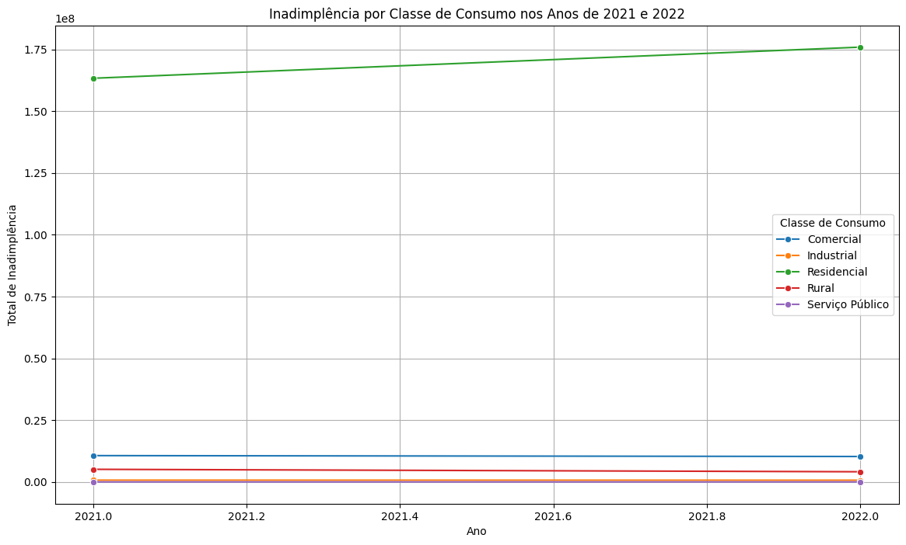

## Pergunta 2: Qual é a correlação entre inadimplência e indicadores econômicos?

A correlação entre inadimplência e indicadores econômicos, como a taxa de desemprego e a inflação, é positiva. Isso significa que, à medida que a taxa de desemprego e a inflação aumentam, a inadimplência também tende a aumentar. A visualização mostra que anos com maior PIB tendem a ter menores taxas de inadimplência, sugerindo uma correlação inversa entre PIB e inadimplência.

### 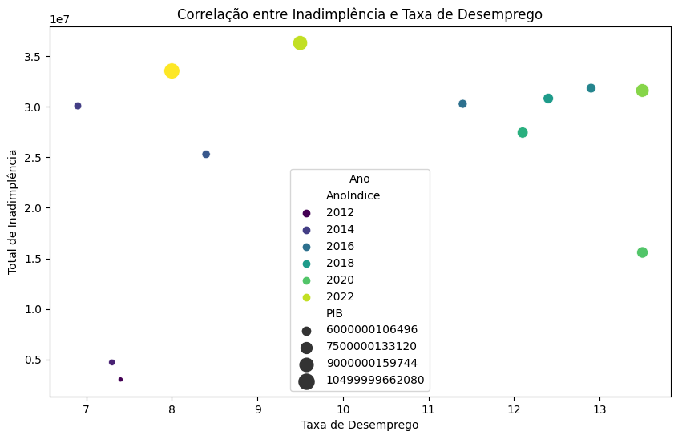

### 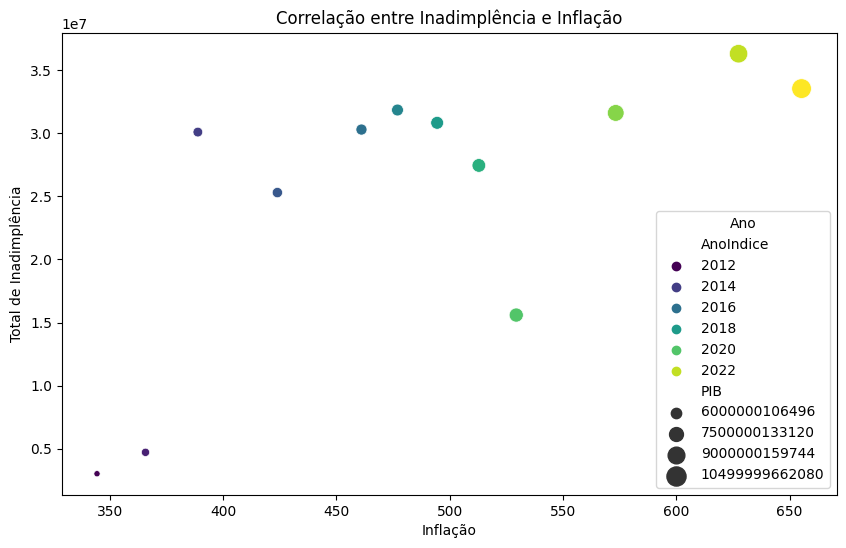

### 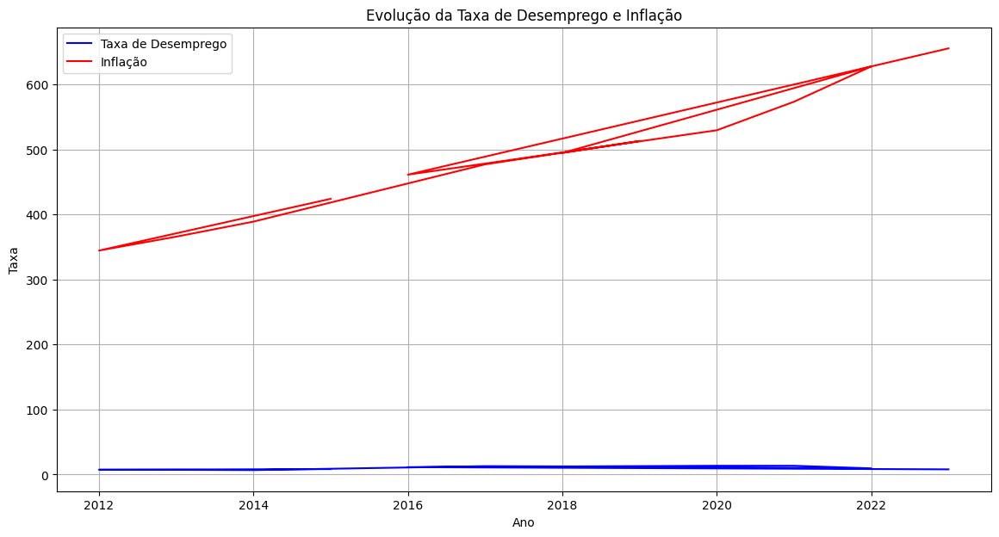

## Pergunta 3: Qual é a tendência geral da inadimplência ao longo dos anos?

A tendência geral da inadimplência ao longo dos anos mostra flutuações significativas. Embora haja um aumento na inadimplência até 2016, há uma queda subsequente e outra alta em 2020, provavelmente devido aos impactos econômicos da pandemia. A tendência de longo prazo, no entanto, indica um aumento gradual na inadimplência.

### 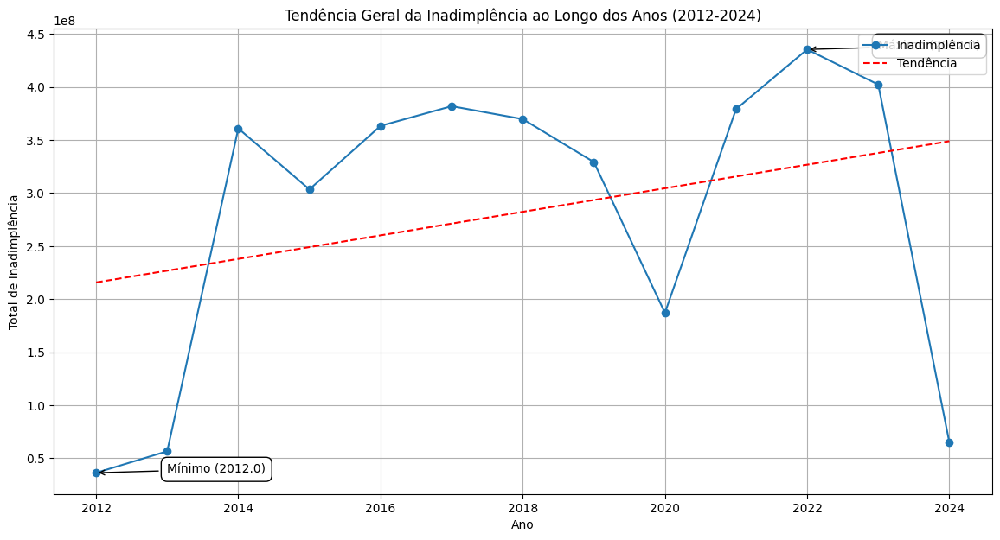

## Pergunta 4: Análise sazonal da inadimplência

A análise sazonal da inadimplência revela que há uma variação significativa durante o ano. Os meses de junho a dezembro mostram uma queda acentuada na inadimplência, enquanto os primeiros meses do ano mantêm níveis mais elevados.

### 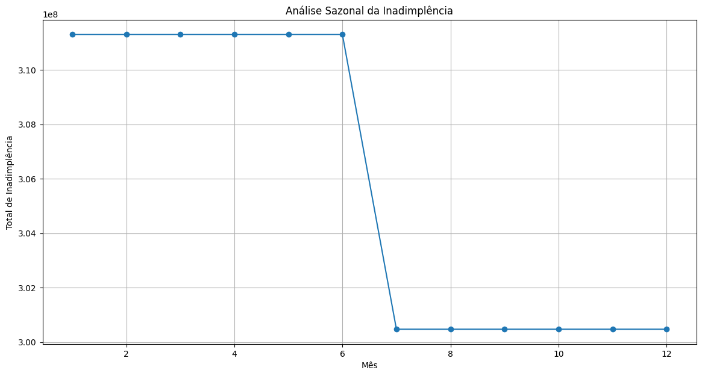

## Pergunta 5: Qual é a performance das distribuidoras em relação à inadimplência (Top 10)?

A performance das distribuidoras em relação à inadimplência mostra que a Equatorial GO e a ENEL RJ têm os maiores valores de inadimplência, seguidas por outras distribuidoras como ELETROPAULO e LIGHT SESA. As distribuidoras com menor inadimplência incluem a CPFL PAULISTA e a EQUATORIAL MA.

### 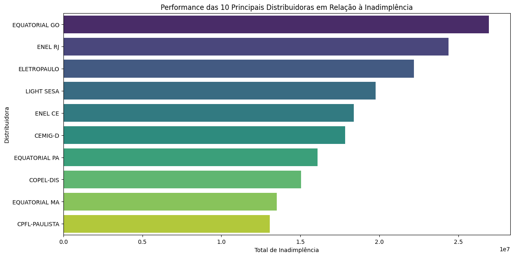

## Pergunta 6: Qual é a análise de inadimplência durante a pandemia (2021-2022)?

Durante a pandemia (2021-2022), a inadimplência aumentou significativamente, como mostrado na primeira imagem. As taxas de desemprego e inflação também aumentaram durante esse período, o que provavelmente contribuiu para o aumento da inadimplência. A segunda imagem mostra a evolução da taxa de desemprego e da inflação durante a pandemia, reforçando a correlação observada entre esses indicadores econômicos e a inadimplência.

### 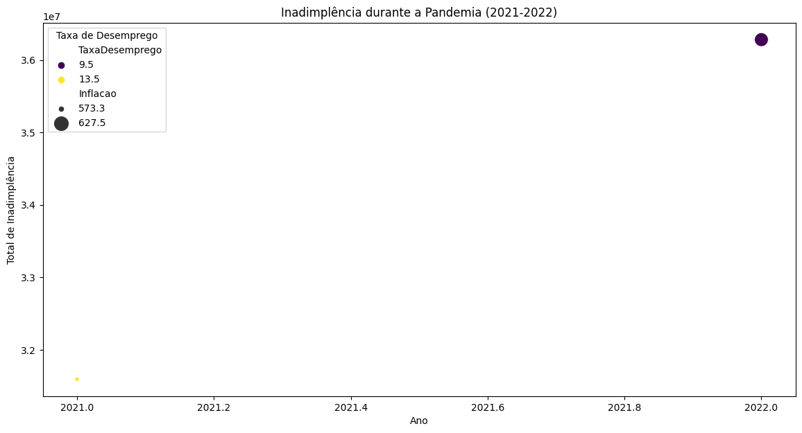

### 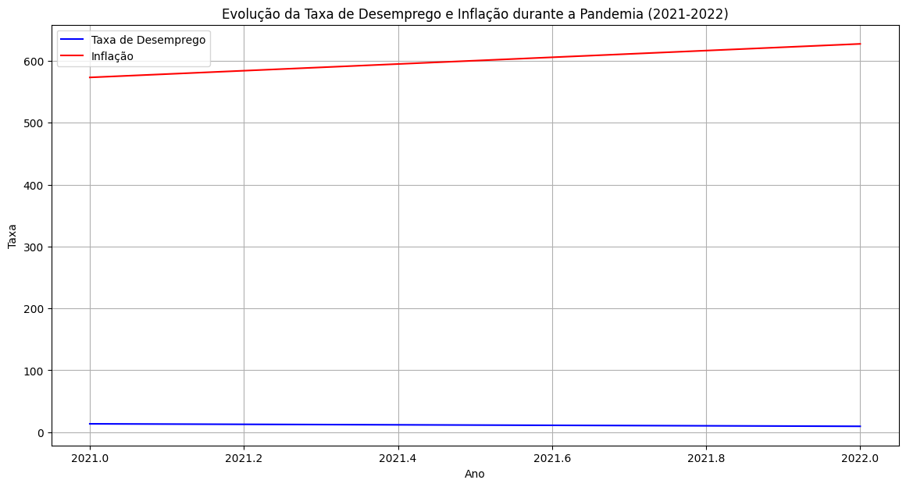

## Conclusão

Essas análises destacam a importância dos indicadores econômicos na compreensão da inadimplência e a necessidade de monitorar esses fatores para prever e mitigar riscos financeiros. As flutuações sazonais e as variações por classe de consumo fornecem insights adicionais para estratégias específicas de gerenciamento de inadimplência.

## Autoavaliação

### Objetivos Atingidos

Ao concluir este trabalho, acredito ter atingido os objetivos estabelecidos no início do projeto. O principal objetivo era analisar a inadimplência dos consumidores das distribuidoras de energia elétrica ao longo dos anos, suas correlações com indicadores econômicos, variações por classe de consumo, e identificar padrões sazonais. As perguntas-chave foram respondidas com sucesso:

1. **Variação da inadimplência por classe de consumo nos anos de 2021 e 2022**:
   - Identificamos variações significativas entre diferentes classes de consumo, com a classe residencial apresentando os maiores valores de inadimplência.
2. **Correlação entre inadimplência e indicadores econômicos**:
   - Encontramos correlações positivas entre inadimplência e indicadores como taxa de desemprego e inflação.
3. **Tendência geral da inadimplência ao longo dos anos**:
   - Observamos uma tendência de aumento na inadimplência ao longo dos anos, com flutuações notáveis em determinados períodos.
4. **Análise sazonal da inadimplência**:
   - Detectamos padrões sazonais, com uma queda acentuada na inadimplência nos meses de junho a dezembro.
5. **Performance das distribuidoras em relação à inadimplência**:
   - Identificamos as distribuidoras com os maiores e menores valores de inadimplência.
6. **Comportamento da inadimplência durante a pandemia (2021-2022)**:
   - Observamos um aumento significativo na inadimplência durante a pandemia, associado ao aumento da taxa de desemprego e inflação.

### Dificuldades Encontradas

Durante a execução do trabalho, encontrei várias dificuldades, incluindo:

- **Limpeza e Preparo dos Dados**:
  - Garantir a integridade e consistência dos dados brutos foi desafiador, exigindo etapas de limpeza e transformação.
- **Integração de Fontes de Dados**:
  - Combinar dados de diferentes fontes e formatos para criar uma visão integrada e coerente foi uma tarefa complexa.
- **Visualização de Dados**:
  - Escolher as visualizações mais apropriadas para representar os resultados de maneira clara e compreensível foi um desafio.
- **Interpretação dos Resultados**:
  - Analisar e interpretar os dados para tirar conclusões significativas exigiu um entendimento profundo do contexto econômico e das operações das distribuidoras de energia elétrica.

### Trabalhos Futuros

Para enriquecer este problema e sua solução no meu portfólio, planejo realizar os seguintes trabalhos futuros:

- **Análise de Dados em Tempo Real**:
  - Implementar um sistema de monitoramento em tempo real para analisar a inadimplência na distribuidora de energia onde trabalho atualmente.
- **Modelos de Previsão**:
  - Desenvolver modelos preditivos utilizando técnicas de machine learning para prever a inadimplência futura com base nos dados históricos e indicadores econômicos.
- **Exploração de Outros Indicadores Econômicos**:
  - Incluir e analisar a correlação de inadimplência com outros indicadores econômicos.
- **Estudos de Caso Detalhados**:
  - Realizar estudos de caso detalhados sobre distribuidoras específicas (farei na distribuidora onde trabalho atualmente) para entender melhor os fatores que influenciam a inadimplência em diferentes regiões e condições econômicas.
- **Automação do Processo de Análise**:
  - Automatizar o processo de análise e geração de relatórios para facilitar a atualização contínua dos insights à medida que novos dados se tornam disponíveis.

Este trabalho foi uma experiência valiosa para entender a complexidade da inadimplência nas distribuidoras de energia elétrica e sua relação com indicadores econômicos. Somente consegui alcançar esses objetivos porque a sprint de Engenharia de Dados da PUC-Rio trouxe informações aprofundadas e abrangentes sobre todo o processo envolvido em _Bancos de Dados_, _Data Warehouse e Data Lake_ e _Governança de Dados_. As dificuldades enfrentadas proporcionaram um aprendizado significativo, e os trabalhos futuros planejados permitirão aprimorar ainda mais essa análise, tornando-a mais robusta e abrangente.
