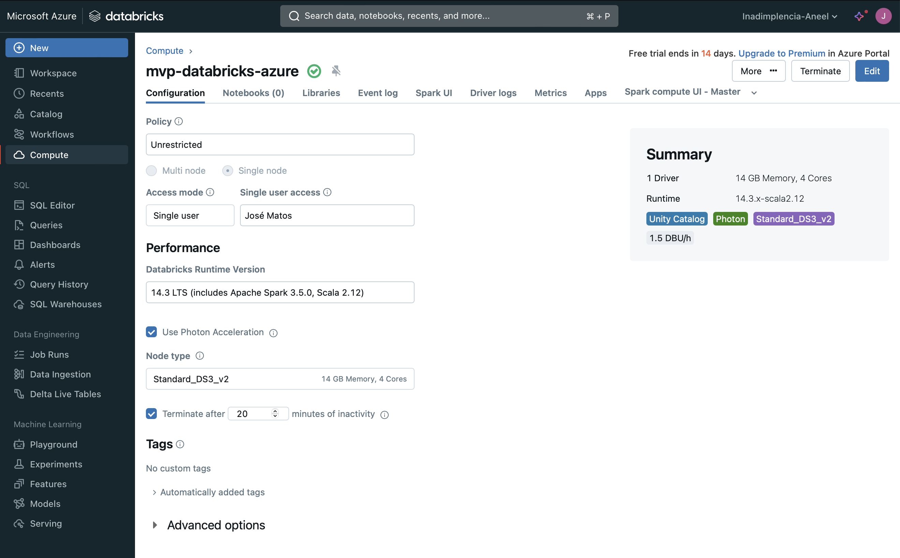

## Objetivo

O objetivo deste projeto é analisar a inadimplência dos consumidores das distribuidoras de energia elétrica ao longo dos anos, suas correlações com indicadores econômicos, variações por classe de consumo, e identificar padrões sazonais.

## Perguntas a Serem Respondidas

Como a inadimplência varia por classe de consumo nos anos de 2021 e 2022?
Qual é a correlação entre inadimplência e indicadores econômicos?
Qual é a tendência geral da inadimplência ao longo dos anos?
Qual é a análise sazonal da inadimplência?
Qual é a performance das distribuidoras em relação à inadimplência (Top 10)?
Qual é a análise de inadimplência durante a pandemia (2021-2022)?

## Descrição

Este repositório contém o projeto MVP do curso de Engenharia de Dados, focado na análise de inadimplência dos consumidores das distribuidoras de energia elétrica utilizando as plataformas Azure e Databricks. O objetivo principal é entender as variações de inadimplência ao longo dos anos, suas correlações com indicadores econômicos, variações por classe de consumo, e identificar padrões sazonais.

## Estrutura do Projeto

### Camada Bronze

Armazenamento dos dados brutos extraídos de diversas fontes, mantendo-os em seu formato original.

### Camada Silver

Nesta camada, os dados da camada Bronze são limpos e transformados, aplicando regras de qualidade e padronização.

### Camada Gold

Dados refinados e integrados para análises e visualizações. Tabelas de fato e dimensões são criadas usando o esquema estrela.

## Fontes de Dados

- [Inadimplência nas Distribuidoras - Dados Abertos GOV.BR](https://dados.gov.br/dados/conjuntos-dados/indqual-inadimplencia)

- [Produto Interno Bruto (PIB) - Dados Abertos GOV.BR](https://api.bcb.gov.br/dados/serie/bcdata.sgs.1207/dados?formato=csv&dataInicial=01/01/2012&dataFinal=31/05/2024)

- [Inflação (IPCA) e Taxa Desemprego - IPEA Dados Abertos GOV.BR](https://www.ipea.gov.br/cartadeconjuntura/index.php/series-estatisticas-conjunturais-2/)

## Cluster configurado

## 
